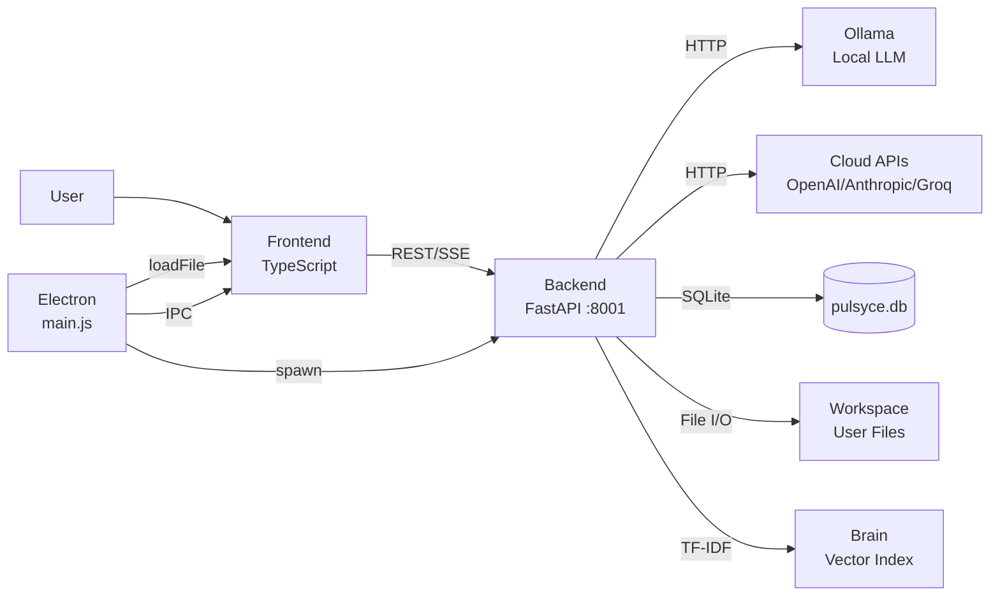

# Architecture

> Lumina IDE v10 — System Architecture Overview

---

## High-Level Overview

Lumina IDE is a **three-tier desktop application**:

```
┌─────────────────────────────────────────────────┐
│                  ELECTRON SHELL                  │
│          (main.js · process manager)             │
│                                                  │
│   ┌─────────────────┐   ┌─────────────────────┐ │
│   │    FRONTEND      │   │     BACKEND          │ │
│   │  (TypeScript)    │◄─►│     (Python)         │ │
│   │  Vite · DOM      │   │  FastAPI · Uvicorn   │ │
│   │  Port: file://   │   │  Port: 8001          │ │
│   └─────────────────┘   └─────────────────────┘ │
└─────────────────────────────────────────────────┘
```

### Layer Responsibilities

| Layer | Role |
|-------|------|
| **Electron** | Process lifecycle (spawn/kill backend), window management, native dialogs (folder picker, image picker), IPC bridge, keyboard shortcut forwarding |
| **Frontend** | All UI rendering via pure DOM manipulation, state management via localStorage/PubSub, API communication via fetch/SSE |
| **Backend** | REST API, LLM orchestration, workspace operations, file I/O, terminal PTY, Brain vector search, SQLite persistence |

---

## Data Flow



---

## Frontend Architecture

The frontend is **framework-free** for the main IDE shell. React is used only for the Design Studio visual builder.

### Module Map

```
frontend-ts/src/
├── main.ts                    # Bootstrap, panel orchestration, keyboard shortcuts
├── style.css                  # Complete design system (5200+ lines)
├── api/
│   └── client.ts              # Typed API client (fetch wrappers for all endpoints)
├── core/
│   ├── EditorManager.ts       # Multi-tab code editor with syntax highlighting
│   ├── TerminalManager.ts     # xterm.js integration with WebSocket PTY
│   ├── PubSub.ts              # Event bus for cross-panel communication
│   └── i18n.ts                # Internationalization (PT-BR, EN, ES)
└── ui/
    ├── AgentPanel.ts           # AI chat with streaming, thinking blocks, file ops
    ├── LibraryPanel.ts         # Document management, personality editor, memories
    ├── GitPanel.ts             # Git staging, commit, branch, diff viewer
    ├── SettingsPanel.ts        # Cloud API keys, model selection, preferences
    ├── Telemetry.ts            # Usage stats, token costs, ROI dashboard
    ├── LLMPanel.ts             # Model management and download status
    ├── MeshPanel.ts            # Swarm Mesh multi-model orchestration UI
    ├── PreviewPanel.ts         # Live HTML/CSS/JS preview with iframe
    ├── MusicPanel.ts           # Ambient music player (lo-fi, nature, etc.)
    ├── ExtensionsPanel.ts      # Extension marketplace and manager
    ├── Sidebar.ts              # File tree, search, activity bar
    ├── ThemeEngine.ts          # Dynamic theming with Catppuccin palette
    ├── OnboardingGuide.ts      # First-run tutorial
    ├── WebStudioPanel.ts       # Full WYSIWYG page builder (114KB)
    ├── ds-*.ts                 # Design Studio modules (components, snap, tokens...)
    └── ws-*.ts                 # Web Studio modules (properties, rulers, export...)
```

### Panel System

All panels follow the same pattern:
1. **init function** receives a container element
2. Renders HTML via template literals
3. Wires events via `addEventListener`
4. Communicates with backend via `api/client.ts`
5. Cross-panel events via `PubSub`

---

## Backend Architecture

### Module Map

```
backend/
├── main.py              # FastAPI app factory, CORS, lifespan hooks
│                        # Registers 5 routers: api, workspace, extensions, terminal, setup
├── router.py            # Main API routes (~3100 lines)
├── config.py            # Settings from .env + cloud config persistence
├── database.py          # SQLite engine, auto-migration, sessions
├── models.py            # SQLModel schemas (UsageLog, ChatSession, Library*, Memory)
│
├── agent.py             # Agentic coding engine
│                        #   - File creation, editing, deletion
│                        #   - Diff generation and application
│                        #   - Multi-step planning with confirmation
│
├── brain.py             # Vector search engine (TF-IDF)
│                        #   - Code indexing by file
│                        #   - Semantic search for context injection
│                        #   - Library document search
│
├── library.py           # Document processing
│                        #   - PDF extraction (PyMuPDF)
│                        #   - DOCX parsing (python-docx)
│                        #   - Personality prompt management
│
├── memory.py            # Persistent agent memory
│                        #   - SQLite-backed (agent_memories table)
│                        #   - Auto-detection of user feedback
│                        #   - Keyword recall for prompt injection
│
├── swarm_mesh.py        # Multi-model orchestration
│                        #   - Tiered routing (small → medium → large)
│                        #   - LLM response cache
│                        #   - Parallel model execution
│
├── workspace.py         # File tree, read/write, workspace scanning (own router: /api/workspace)
├── terminal.py          # PTY terminal via WebSocket (own router: /api/ws/terminal)
├── extensions.py        # Plugin system management (own router: /api/extensions)
├── setup_manager.py     # Setup wizard and motor control (own router: /api/setup)
├── handler_*.py         # Model-size-specific prompt handlers (small, medium, large, cloud)
├── model_tiers.py       # Model classification and capability mapping
├── ollama_orchestrator.py # Ollama process lifecycle and motor management
├── sentinel.py          # Security scanning and Shield reports
├── healer.py            # Auto-healing for common errors
├── watcher.py           # File system watcher for live reload
├── skills.py            # Extensible skill system for the agent
├── edge_runtime.py      # Edge functions sandbox runtime
├── predictor.py         # Code completion predictions
├── telemetry.py         # Usage tracking and analytics
├── identity.py          # HWID-based identity binding
├── security_vault.py    # Encrypted secrets storage
├── logger_utils.py      # SSE logging utilities
└── chunker.py           # Text chunking for Brain indexing
```

### Database Schema

```
pulsyce.db (SQLite)
├── usage_logs           # Every AI generation call (provider, model, tokens, cost)
├── app_config           # Key-value application settings
├── chat_sessions        # Conversation metadata (title, model, timestamps)
├── chat_messages        # Individual messages per session (role, content)
├── library_documents    # Uploaded doc metadata (name, type, folder, pages)
├── library_folders      # Folder organization for documents
├── personality_config   # Custom system prompt for agent behavior
├── agent_memories       # Persistent memories (type, content, source)
└── projecty_identity    # HWID identity binding
```

---

## Communication Protocol

### Frontend → Backend

All communication is via **HTTP REST** to `http://127.0.0.1:8001/api/`.

- **Standard requests**: JSON request/response
- **AI generation**: Server-Sent Events (SSE) streaming via `text/event-stream`
- **Terminal**: WebSocket at `ws://127.0.0.1:8001/api/ws/terminal/{port}`
- **File watcher**: WebSocket at `ws://127.0.0.1:8001/api/ws/watcher`

### Electron → Frontend

- **IPC channels**: `window-minimize`, `window-maximize`, `window-close`
- **IPC handles**: `dialog-select-folder`, `dialog-select-image`, `dialog-select-video`
- **Shortcut forwarding**: `shortcut` channel for Ctrl+B, Ctrl+Shift+X

---

## AI Pipeline

```
User Prompt
    │
    ▼
┌─────────────────────┐
│  Memory Injection    │  ← Recall relevant memories from SQLite
│  Personality Prompt  │  ← Custom system prompt from Library
│  Brain Context       │  ← TF-IDF search for relevant code
│  Workspace Tree      │  ← Current file structure
│  Thinking Mode       │  ← Optional CoT prompt injection
└─────────┬───────────┘
          │
          ▼
┌─────────────────────┐
│  Model Selection     │
│  ├── Local (Ollama)  │  → Mistral, Llama, Qwen, Deepseek...
│  └── Cloud           │  → OpenAI, Anthropic, Groq, Google
└─────────┬───────────┘
          │
          ▼
┌─────────────────────┐
│  SSE Streaming       │  → Token-by-token to frontend
│  Agent Actions       │  → Parse file operations from response
│  Memory Extraction   │  → Auto-save feedback patterns
│  Usage Logging       │  → Track tokens, cost, latency
└─────────────────────┘
```
