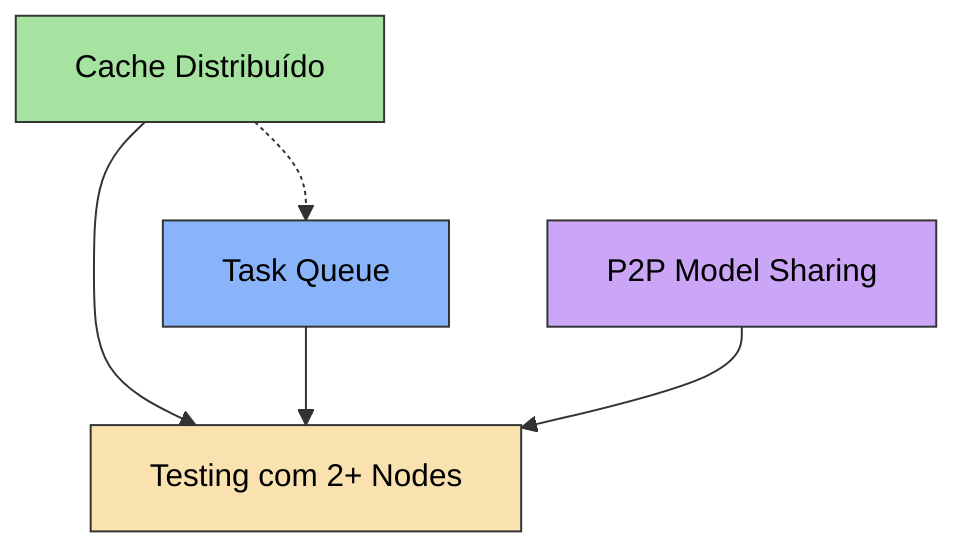

# 🐝 Colmeia v3.0 — Plano de Implementação

> Três features que transformam a Colmeia de um sistema de delegação simples em uma plataforma de computação distribuída real.

---

## Índice

1. [Cache Distribuído (Shared Brain)](#1-cache-distribuído-shared-brain)
2. [Task Queue Inteligente](#2-task-queue-inteligente)
3. [P2P Model Sharing](#3-p2p-model-sharing)

---

## 1. Cache Distribuído (Shared Brain)

### Objetivo
Quando um node recebe uma pergunta, antes de rodar inferência, consulta o cache dos peers na rede. Se outro node já respondeu algo similar, retorna instantaneamente — zero GPU, zero latência.

### Arquitetura

```
┌──────────────┐     cache miss     ┌──────────────┐
│   Node A     │ ─────────────────► │   Node B     │
│  cache_get() │     HTTP GET       │ /mesh/cache  │
│              │ ◄───────────────── │  cache HIT!  │
│  usa resposta│     resposta       │              │
└──────────────┘                    └──────────────┘
```

### Mudanças Necessárias

#### Backend: `swarm_mesh.py`

**Novo endpoint para consulta remota de cache:**
```python
# Adicionar ao router.py
@router.get("/mesh/cache/query")
async def mesh_cache_query(key: str):
    """Permite que peers consultem nosso cache local."""
    import swarm_mesh as mesh
    entry = mesh._llm_cache.get(key)
    if entry and (time.time() - entry["timestamp"]) < mesh._LLM_CACHE_TTL:
        return {"hit": True, "response": entry["response"]}
    return {"hit": False}
```

**Modificar `cache_get()` para fallback remoto:**
```python
def cache_get(prompt: str, model: str) -> Optional[str]:
    key = _make_cache_key(prompt, model)
    
    # 1. Check local cache first
    entry = _llm_cache.get(key)
    if entry and (time.time() - entry["timestamp"]) < _LLM_CACHE_TTL:
        logger.info(f"⚡ Cache HIT (local) for key {key[:8]}...")
        return entry["response"]
    
    # 2. Check remote peers (async → sync bridge)
    for nid, node in discovered_nodes.items():
        try:
            import requests
            resp = requests.get(
                f"http://{node.ip}:{node.port}/api/mesh/cache/query",
                params={"key": key},
                timeout=1.5  # Fast timeout — cache must be instant
            )
            if resp.ok:
                data = resp.json()
                if data.get("hit"):
                    response = data["response"]
                    # Store locally for future hits
                    cache_put(prompt, model, response)
                    logger.info(f"⚡ Cache HIT (remote: {node.ip}) for key {key[:8]}...")
                    return response
        except Exception:
            continue
    
    return None
```

**Novo: Cache Index Broadcast (opcional, otimização):**
```python
# Em vez de consultar cada peer, broadcast o índice de keys
# durante refresh_node_status() e mantenha um mapa local
# de qual peer tem qual key. Mais rápido, menos requests.

_remote_cache_index: Dict[str, str] = {}  # key_hash → node_ip

async def refresh_cache_index():
    """Puxar lista de keys cacheadas de cada peer."""
    import httpx
    async with httpx.AsyncClient(timeout=2.0) as client:
        for nid, node in discovered_nodes.items():
            try:
                resp = await client.get(
                    f"http://{node.ip}:{node.port}/api/mesh/cache/keys"
                )
                if resp.status_code == 200:
                    keys = resp.json().get("keys", [])
                    for k in keys:
                        _remote_cache_index[k] = node.ip
            except Exception:
                continue
```

#### Frontend: `MeshPanel.ts`

- Adicionar contador de "Cache Hits (Remote)" no painel de LLM Cache
- Badge mostrando "SHARED" quando há peers com cache ativo

### Estimativa
- **Dificuldade:** Fácil
- **Tempo:** ~2h
- **Arquivos modificados:** `swarm_mesh.py`, `router.py`, `MeshPanel.ts`
- **Risco:** Baixo — fallback ao local se peers offline

---

## 2. Task Queue Inteligente

### Objetivo
Um node coordenador recebe todas as requests LLM da rede e despacha para a máquina ideal baseado em: modelo já carregado em VRAM, VRAM livre, latência, e fila de tarefas pendentes.

### Arquitetura

```
┌─────────────┐  submit   ┌──────────────────┐  dispatch  ┌─────────────┐
│  Node A     │ ────────► │  COORDENADOR     │ ─────────► │  Node B     │
│  (client)   │           │  (maior VRAM)    │            │  (worker)   │
│             │ ◄──────── │  task_queue      │ ◄───────── │  result     │
│  resultado  │  result   │  model_routing   │            │             │
└─────────────┘           └──────────────────┘            └─────────────┘
                                  │
                                  │ dispatch
                                  ▼
                          ┌─────────────┐
                          │  Node C     │
                          │  (worker)   │
                          └─────────────┘
```

### Mudanças Necessárias

#### Backend: `swarm_mesh.py` — Novas classes

```python
from dataclasses import dataclass, field
from asyncio import Queue
import uuid

@dataclass
class MeshTask:
    id: str = field(default_factory=lambda: str(uuid.uuid4())[:8])
    prompt: str = ""
    model: str = ""
    system_prompt: str = ""
    history: list = field(default_factory=list)
    priority: int = 0          # 0=normal, 1=high, 2=urgent
    submitted_at: float = 0.0
    assigned_to: str = ""      # node IP
    status: str = "pending"    # pending → processing → done → failed
    result: str = ""
    submitted_by: str = ""     # IP of submitter

class TaskQueue:
    def __init__(self):
        self.tasks: Dict[str, MeshTask] = {}
        self.queue: list = []  # Sorted by priority
    
    def submit(self, task: MeshTask) -> str:
        task.submitted_at = time.time()
        self.tasks[task.id] = task
        self.queue.append(task.id)
        self.queue.sort(key=lambda tid: self.tasks[tid].priority, reverse=True)
        return task.id
    
    def get_next(self) -> Optional[MeshTask]:
        while self.queue:
            tid = self.queue.pop(0)
            task = self.tasks.get(tid)
            if task and task.status == "pending":
                return task
        return None
    
    def complete(self, task_id: str, result: str):
        if task_id in self.tasks:
            self.tasks[task_id].status = "done"
            self.tasks[task_id].result = result
    
    def stats(self) -> dict:
        pending = sum(1 for t in self.tasks.values() if t.status == "pending")
        processing = sum(1 for t in self.tasks.values() if t.status == "processing")
        done = sum(1 for t in self.tasks.values() if t.status == "done")
        return {"pending": pending, "processing": processing, "done": done, "total": len(self.tasks)}

_task_queue = TaskQueue()
```

#### Backend: `router.py` — Novos endpoints

```python
@router.post("/mesh/tasks/submit")
async def submit_mesh_task(body: dict):
    """Submit a task to the intelligent queue."""
    import swarm_mesh as mesh
    task = mesh.MeshTask(
        prompt=body.get("prompt", ""),
        model=body.get("model", ""),
        system_prompt=body.get("system_prompt", ""),
        history=body.get("history", []),
        priority=body.get("priority", 0),
        submitted_by=body.get("from_ip", ""),
    )
    task_id = mesh._task_queue.submit(task)
    return {"task_id": task_id, "status": "queued"}

@router.get("/mesh/tasks/{task_id}")
async def get_task_result(task_id: str):
    """Poll for task result."""
    import swarm_mesh as mesh
    task = mesh._task_queue.tasks.get(task_id)
    if not task:
        return {"error": "Task not found"}
    return {"task_id": task_id, "status": task.status, "result": task.result}

@router.get("/mesh/tasks/stats")
async def task_queue_stats():
    import swarm_mesh as mesh
    return mesh._task_queue.stats()
```

#### Coordinator Election & Dispatch

```python
def elect_coordinator() -> Optional[str]:
    """O node com mais VRAM total é o coordenador."""
    best_ip = None
    best_vram = 0.0
    
    # Check self
    local_gpu = get_gpu_info()  # Existing function
    local_vram = local_gpu.get("vram_total_gb", 0)
    if local_vram > best_vram:
        best_vram = local_vram
        best_ip = get_local_ip()
    
    # Check peers
    for node in discovered_nodes.values():
        if node.vram_free_gb > best_vram:
            best_vram = node.vram_free_gb
            best_ip = node.ip
    
    return best_ip

def select_optimal_node(task: MeshTask) -> Optional[MeshNode]:
    """Seleciona o melhor node baseado em múltiplos critérios."""
    candidates = []
    
    for node in discovered_nodes.values():
        score = 0
        
        # Critério 1: Modelo já carregado (+50 pontos)
        if task.model and node.loaded_model and task.model in node.loaded_model:
            score += 50
        
        # Critério 2: Modelo instalado (+20 pontos)
        if task.model and task.model in [m.split(":")[0] for m in node.installed_models]:
            score += 20
        
        # Critério 3: VRAM disponível (+1 ponto por GB)
        score += int(node.vram_free_gb)
        
        # Critério 4: CPU disponível (+0.1 por % livre)
        score += int((100 - node.cpu_usage_pct) * 0.1)
        
        # Critério 5: RAM disponível
        score += int(node.ram_free_gb * 0.5)
        
        candidates.append((node, score))
    
    if not candidates:
        return None
    
    candidates.sort(key=lambda x: x[1], reverse=True)
    return candidates[0][0]

async def dispatch_loop():
    """Background task: coordenador despacha tarefas da fila."""
    while True:
        task = _task_queue.get_next()
        if task:
            best_node = select_optimal_node(task)
            if best_node:
                task.status = "processing"
                task.assigned_to = best_node.ip
                
                # Send to worker
                try:
                    import httpx
                    async with httpx.AsyncClient(timeout=60.0) as client:
                        resp = await client.post(
                            f"http://{best_node.ip}:{best_node.port}/api/generate",
                            json={
                                "prompt": task.prompt,
                                "model": task.model,
                                "stream": False,
                            }
                        )
                        if resp.status_code == 200:
                            result = resp.json().get("response", "")
                            _task_queue.complete(task.id, result)
                except Exception as e:
                    task.status = "failed"
                    task.result = f"Error: {e}"
        
        await asyncio.sleep(0.5)
```

#### Frontend: `MeshPanel.ts`

- Seção "Task Queue" no painel mostrando: pending, processing, done
- Badge do coordenador ("👑 COORDINATOR" ou "⚙️ WORKER")

### Estimativa
- **Dificuldade:** Média
- **Tempo:** ~4h
- **Arquivos modificados:** `swarm_mesh.py`, `router.py`, `MeshPanel.ts`
- **Risco:** Médio — precisa de testes com múltiplas máquinas

---

## 3. P2P Model Sharing

### Objetivo
Quando um node precisa de um modelo que não tem, mas outro node na rede já tem baixado, transferir via LAN em vez de baixar da internet. Transferência Gigabit LAN: ~5 minutos para 40GB vs horas pela internet.

### Arquitetura

```
┌─────────────┐                     ┌─────────────┐
│  Node A     │  "quero llama3.3"   │  Node B     │
│  (sem modelo)│ ──────────────────► │  (tem modelo)│
│             │                     │             │
│             │  ◄──── stream ───── │ /mesh/model │
│             │   blobs + manifest  │  /transfer  │
│  ollama     │                     │             │
│  reconhece! │                     │             │
└─────────────┘                     └─────────────┘
```

### Pesquisa: Como Ollama armazena modelos

Ollama armazena modelos em:
- **Windows:** `C:\Users\<user>\.ollama\models\`
- **Linux:** `/usr/share/ollama/.ollama/models/`
- **macOS:** `~/.ollama/models/`

Estrutura:
```
models/
├── blobs/           # Arquivos binários (pesos do modelo)
│   ├── sha256-<hash1>   # Camada de pesos (~4-40GB)
│   ├── sha256-<hash2>   # Template
│   └── sha256-<hash3>   # Params/config
├── manifests/
│   └── registry.ollama.ai/
│       └── library/
│           └── llama3.3/
│               └── 70b-instruct-q4_K_M   # JSON manifest
```

O **manifest** é um JSON que referencia os blobs por digest SHA256:
```json
{
  "layers": [
    {"digest": "sha256:abc123...", "mediaType": "application/vnd.ollama.image.model", "size": 4000000000},
    {"digest": "sha256:def456...", "mediaType": "application/vnd.ollama.image.template", "size": 1234},
    {"digest": "sha256:ghi789...", "mediaType": "application/vnd.ollama.image.params", "size": 567}
  ]
}
```

### Estratégia de Transferência

**Opção A: Transferência de Blobs (Recomendada)**
1. Node A pede a Node B o manifest do modelo
2. Node A checa quais blobs já tem localmente
3. Node A pede apenas os blobs que faltam (streaming HTTP)
4. Node A escreve os blobs em `~/.ollama/models/blobs/`
5. Node A escreve o manifest em `~/.ollama/models/manifests/`
6. Ollama detecta automaticamente no próximo `ollama list`

**Opção B: Ollama Pull via proxy (Simples mas limitada)**
1. Node B expõe seus modelos como um "registry" local
2. Node A faz `ollama pull` apontando pro Node B como registry
3. Mais simples mas requer configurar Ollama custom registry

### Mudanças Necessárias

#### Backend: `swarm_mesh.py` — P2P Transfer

```python
import os
import platform

def get_ollama_models_dir() -> str:
    """Retorna o diretório de modelos do Ollama."""
    if platform.system() == "Windows":
        return os.path.join(os.path.expanduser("~"), ".ollama", "models")
    elif platform.system() == "Darwin":
        return os.path.join(os.path.expanduser("~"), ".ollama", "models")
    else:
        # Linux — check both paths
        home_path = os.path.join(os.path.expanduser("~"), ".ollama", "models")
        system_path = "/usr/share/ollama/.ollama/models"
        return home_path if os.path.exists(home_path) else system_path

def get_model_manifest(model_name: str) -> Optional[dict]:
    """Lê o manifest de um modelo local do Ollama."""
    models_dir = get_ollama_models_dir()
    # Parse model name: "llama3.3:70b" → library/llama3.3/70b
    parts = model_name.split(":")
    name = parts[0]
    tag = parts[1] if len(parts) > 1 else "latest"
    
    manifest_path = os.path.join(
        models_dir, "manifests", "registry.ollama.ai", "library", name, tag
    )
    
    if os.path.exists(manifest_path):
        import json
        with open(manifest_path, "r") as f:
            return json.load(f)
    return None

def get_model_transfer_info(model_name: str) -> Optional[dict]:
    """Retorna info para transferência P2P de um modelo."""
    manifest = get_model_manifest(model_name)
    if not manifest:
        return None
    
    models_dir = get_ollama_models_dir()
    blobs_dir = os.path.join(models_dir, "blobs")
    
    layers = []
    total_size = 0
    for layer in manifest.get("layers", []):
        digest = layer["digest"]
        size = layer.get("size", 0)
        blob_path = os.path.join(blobs_dir, digest.replace(":", "-"))
        exists = os.path.exists(blob_path)
        layers.append({
            "digest": digest,
            "size": size,
            "mediaType": layer.get("mediaType", ""),
            "available": exists,
        })
        total_size += size
    
    return {
        "model": model_name,
        "total_size": total_size,
        "total_size_gb": round(total_size / (1024**3), 2),
        "layers": layers,
        "manifest": manifest,
    }
```

#### Backend: `router.py` — Novos endpoints P2P

```python
from fastapi.responses import StreamingResponse
import os

@router.get("/mesh/models/available")
async def mesh_models_available():
    """Lista modelos disponíveis para compartilhamento P2P."""
    import swarm_mesh as mesh
    models = []
    models_dir = mesh.get_ollama_models_dir()
    manifest_base = os.path.join(models_dir, "manifests", "registry.ollama.ai", "library")
    
    if os.path.exists(manifest_base):
        for model_name in os.listdir(manifest_base):
            model_path = os.path.join(manifest_base, model_name)
            if os.path.isdir(model_path):
                for tag in os.listdir(model_path):
                    full_name = f"{model_name}:{tag}"
                    info = mesh.get_model_transfer_info(full_name)
                    if info:
                        models.append({
                            "name": full_name,
                            "size_gb": info["total_size_gb"],
                            "layers_count": len(info["layers"]),
                        })
    
    return {"models": models}

@router.get("/mesh/models/manifest/{model_name}")
async def mesh_model_manifest(model_name: str):
    """Retorna o manifest de um modelo para transferência P2P."""
    import swarm_mesh as mesh
    info = mesh.get_model_transfer_info(model_name)
    if not info:
        raise HTTPException(404, "Model not found")
    return info

@router.get("/mesh/models/blob/{digest}")
async def mesh_model_blob(digest: str):
    """Streaming de um blob binário para transferência P2P."""
    import swarm_mesh as mesh
    models_dir = mesh.get_ollama_models_dir()
    blob_path = os.path.join(models_dir, "blobs", digest.replace(":", "-"))
    
    if not os.path.exists(blob_path):
        raise HTTPException(404, "Blob not found")
    
    file_size = os.path.getsize(blob_path)
    
    def stream_blob():
        CHUNK_SIZE = 1024 * 1024  # 1MB chunks
        with open(blob_path, "rb") as f:
            while chunk := f.read(CHUNK_SIZE):
                yield chunk
    
    return StreamingResponse(
        stream_blob(),
        media_type="application/octet-stream",
        headers={
            "Content-Length": str(file_size),
            "X-Blob-Digest": digest,
        }
    )

@router.post("/mesh/models/pull-from-peer")
async def pull_model_from_peer(body: dict):
    """Baixa um modelo de um peer da Colmeia via LAN."""
    import swarm_mesh as mesh
    import httpx
    
    peer_ip = body.get("peer_ip")
    peer_port = body.get("peer_port", 8001)
    model_name = body.get("model")
    
    if not peer_ip or not model_name:
        raise HTTPException(400, "peer_ip and model required")
    
    # 1. Get manifest from peer
    async with httpx.AsyncClient(timeout=10.0) as client:
        resp = await client.get(
            f"http://{peer_ip}:{peer_port}/api/mesh/models/manifest/{model_name}"
        )
        if resp.status_code != 200:
            return {"error": f"Model {model_name} not found on peer"}
        
        info = resp.json()
    
    models_dir = mesh.get_ollama_models_dir()
    blobs_dir = os.path.join(models_dir, "blobs")
    os.makedirs(blobs_dir, exist_ok=True)
    
    # 2. Download missing blobs
    downloaded = 0
    skipped = 0
    for layer in info["layers"]:
        digest = layer["digest"]
        blob_path = os.path.join(blobs_dir, digest.replace(":", "-"))
        
        if os.path.exists(blob_path):
            skipped += 1
            continue
        
        # Stream download from peer
        async with httpx.AsyncClient(timeout=600.0) as client:  # 10min timeout for large files
            async with client.stream(
                "GET",
                f"http://{peer_ip}:{peer_port}/api/mesh/models/blob/{digest}"
            ) as resp:
                with open(blob_path, "wb") as f:
                    async for chunk in resp.aiter_bytes(chunk_size=1024*1024):
                        f.write(chunk)
        downloaded += 1
    
    # 3. Write manifest
    parts = model_name.split(":")
    name = parts[0]
    tag = parts[1] if len(parts) > 1 else "latest"
    manifest_dir = os.path.join(
        models_dir, "manifests", "registry.ollama.ai", "library", name
    )
    os.makedirs(manifest_dir, exist_ok=True)
    
    import json
    with open(os.path.join(manifest_dir, tag), "w") as f:
        json.dump(info["manifest"], f, indent=2)
    
    return {
        "status": "success",
        "model": model_name,
        "downloaded_blobs": downloaded,
        "skipped_blobs": skipped,
        "total_size_gb": info["total_size_gb"],
    }
```

#### Frontend: `MeshPanel.ts` — UI de Model Sharing

- Seção "📦 Models na Rede" abaixo dos nodes
- Lista de modelos disponíveis em cada peer com botão "⬇️ Baixar via LAN"
- Progress bar de download
- Comparação de velocidade: "~5min via LAN vs ~2h via internet"

### Estimativa
- **Dificuldade:** Média-Alta
- **Tempo:** ~5h
- **Arquivos modificados:** `swarm_mesh.py`, `router.py`, `MeshPanel.ts`
- **Risco:** Médio — depende da estrutura de diretórios do Ollama não mudar entre versões

---

## Dependências e Ordem de Implementação



### Ordem recomendada:
1. **Cache Distribuído** — base pra entender comunicação inter-node
2. **Task Queue** — usa padrões do cache, adiciona coordenação
3. **P2P Model Sharing** — independente, mas beneficia do Task Queue pra orquestrar downloads

### Pré-requisitos comuns:
- 2+ máquinas na mesma rede LAN
- Ollama instalado em ambas
- Firewall aberto na porta 8001 (já implementado automaticamente)
- Colmeia ativada em ambos os nodes

---

## Métricas de Sucesso

| Feature | Métrica | Meta |
|---------|---------|------|
| Cache Distribuído | Latência de cache hit remoto | < 200ms |
| Cache Distribuído | % de requests que viram cache hit | > 30% em equipes |
| Task Queue | Throughput total (tasks/min) | 2x vs solo |
| Task Queue | Utilização de GPU across nodes | > 70% |
| P2P Model Sharing | Velocidade de transferência LAN | > 50MB/s |
| P2P Model Sharing | Tempo pra modelo de 10GB | < 3min via Gigabit |

---

## Notas Técnicas

### Segurança
- Todas as comunicações são via HTTP na LAN local
- Sem autenticação por enquanto (rede confiável)
- Para produção: adicionar token compartilhado via Shield identity

### Compatibilidade
- Ollama >= 0.3.x (blobs API)
- Python 3.10+ (async generators)
- Windows/Linux/macOS

### Limitações conhecidas
- P2P Model Sharing assume estrutura de diretórios padrão do Ollama
- Task Queue não persiste entre restarts (in-memory)
- Cache Distribuído tem overhead de rede (~50-200ms por consulta)

---

*Documento criado em: Abril 2026*
*Versão: 1.0*
*Status: Planejado — aguardando implementação*
